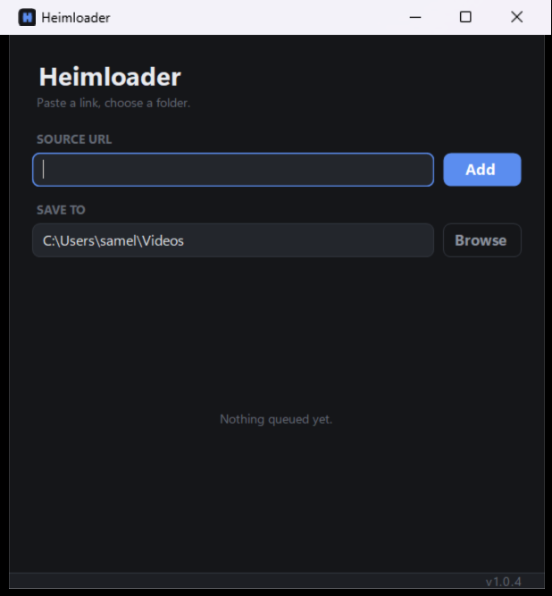

# Heimloader

### Paste a link, choose a folder.

A clean, no-friction media downloader for Windows. Drop in a URL, pick where it lands, and Heimloader
does the rest.

**[⬇ Download for Windows](https://github.com/SamEF/Heimloader-releases/releases/latest/download/Heimloader-win-Setup.exe)**

## ✨ Features

- **Paste a link, done.** No profiles, no command line just a URL and a folder.
- **See it before you save it.** A live preview shows the thumbnail, title, duration, resolution and size.
- **YouTube, TikTok, Pinterest and ~1,800 more.** yt-dlp supports works through the generic path.
- **A real queue.** Run several at once (configurable), and finished downloads jump to the top of the list.
- **Clean progress.** Percentage and speed.
- **Right-click anything** to play it, open its folder, copy the link or file path, remove it, or delete it.
- **Sign-in-gated content**, via a cookies file or your browser's own cookies.
- **Updates itself.** New versions download quietly in the background; a footer notice lets you restart into them when you're ready.
- **Nothing to install first.** Self-contained: no .NET, no Python. The first launch fetches its toolchain automatically.

## ⬇ Download & Install

Windows 10 or 11, 64-bit.

1. Download **[Heimloader-win-Setup.exe](https://github.com/SamEF/Heimloader-releases/releases/latest/download/Heimloader-win-Setup.exe)**.
2. Run it. It isn't code-signed yet, so Windows SmartScreen may warn you. In that case just click **More info → Run anyway**.
3. Heimloader installs, adds Start Menu and Desktop shortcuts, and opens.

Prefer no installer? Grab **[Heimloader-win-Portable.zip](https://github.com/SamEF/Heimloader-releases/releases/latest/download/Heimloader-win-Portable.zip)**, unzip it anywhere, and run `Heimloader.exe`.

> **Heads up:** the first run downloads its toolchain yt-dlp, ffmpeg, and a small JavaScript runtime, up to ~110 MB into your user profile.

## 🚀 Using it

1. Copy a link like a YouTube or TikTok video, almost anything.
2. Paste it into **Source URL**. A preview with the thumbnail appears.
3. Pick a **Save to** folder (defaults to your Downloads).
4. Click **Add**. Watch it in the queue; right-click a finished item to play or open it.

### Authenticated or age-restricted content

Point Heimloader at your cookies by editing `%APPDATA%\Heimloader\settings.json`:

- `"CookiesFile": "C:\\path\\to\\cookies.txt"` a Netscape-format cookies file, **or**
- `"CookiesFromBrowser": "firefox"` read cookies straight from your browser (`chrome`, `edge`, `brave`, `firefox`, …).

## 🔄 Updates

Heimloader checks for updates in the background and stages them silently. When one's ready, the footer
shows **"New update ready - click to restart"** click it once your downloads have finished and you're
on the latest version. No reinstalling needed.

## 🗑️ Uninstall

**Standard removal:** open **Settings → Apps → Installed apps** (or Control Panel → Programs), find
**Heimloader**, and choose **Uninstall**. That removes the app and its Start Menu / Desktop shortcuts.

**Clean up the rest** (optional — reclaims ~110 MB). The app keeps a few things outside the install
folder. To remove them, paste each path into File Explorer's address bar and delete the folder if it's
still there:

- `%LOCALAPPDATA%\Heimloader` the app and its downloaded toolchain (yt-dlp, ffmpeg, Deno)
- `%APPDATA%\Heimloader` your saved settings and logs
- `%LOCALAPPDATA%\velopack\velopack_Heimloader.log` the update log

**Portable version:** just delete the folder you unzipped. Its toolchain still lives in
`%LOCALAPPDATA%\Heimloader\tools` (unless you set up a `tools` folder next to the exe) delete whichever applies.

## ⚙️ Configuration (optional)

Most people never touch this. Advanced settings live in `appsettings.json` next to the app:

| Setting | Default | What it does |
|---|---|---|
| `MaxConcurrentDownloads` | `1` | How many downloads run at once |
| `DefaultDestinationFolder` | Downloads | Fallback save folder |
| `AllowToolDownload` | `true` | Set `false` to require pre-placed tools (locked-down machines) |
| `YtDlpPath` / `FFmpegPath` | auto | Use your own binaries instead of the auto-downloaded ones |

## 💻 Requirements

- Windows 10 or 11 (64-bit)
- ~60 MB for the app, plus ~110 MB for its toolchain

## 🙏 Built with

Heimloader stands on some open-source projects that are fetched at runtime:

- [yt-dlp](https://github.com/yt-dlp/yt-dlp) the download engine
- [FFmpeg](https://ffmpeg.org/) media processing and merging
- [Deno](https://deno.com/) JavaScript runtime for certain extractors
- [Velopack](https://velopack.io/) installer and auto-updates

## 📄 License

© 2026 Heimwinz. All rights reserved. Heimloader is free to use but closed-source, and is provided as-is
without warranty. Please use it responsibly and respect the terms of service and copyright of the sites
you download from.
